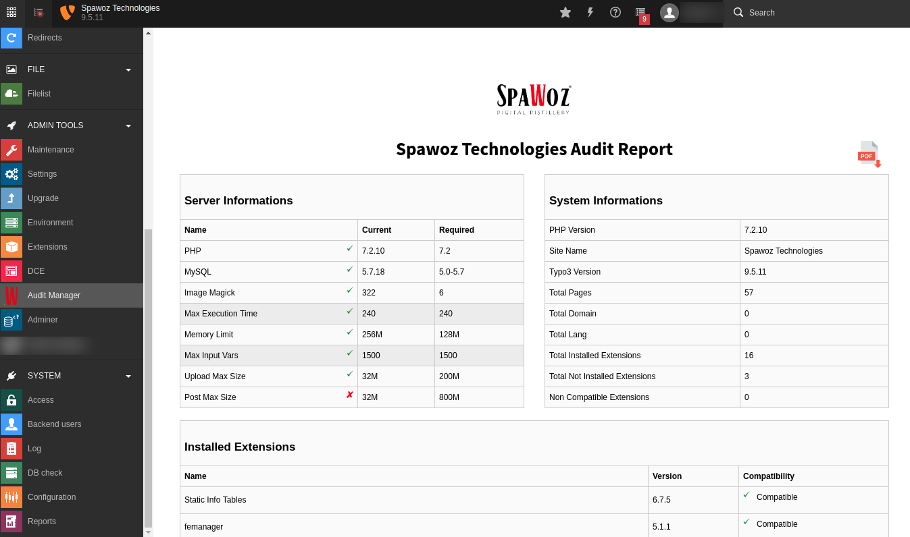

.. ==================================================
.. FOR YOUR INFORMATION
.. --------------------------------------------------
.. -*- coding: utf-8 -*- with BOM.

.. include:: ../Includes.txt

.. _introduction:

Introduction
============

.. _what-it-does:

What does it do?
----------------

This extension can be used to analyse a complete TYPO3 website system overview and it can be used to understand the server details 
and the extensions installed and their compatibility which are installed in the system. It is also possible to save this report as
 a PDF file.

.. important::

   Please don't forget to repeat your extension's version number in the
   :file:`Settings.yml` file, in the :code:`release` property. It will be
   automatically picked up on the cover page by the :code:`|release|`
   substitution.

.. _screenshots:

Screenshots
-----------

This chapter should help people figure how the extension works. Remove it
if not relevant.

